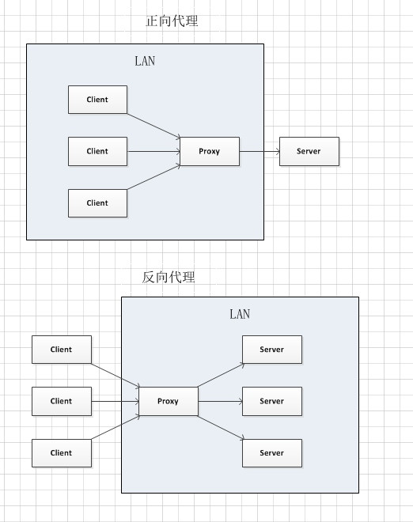
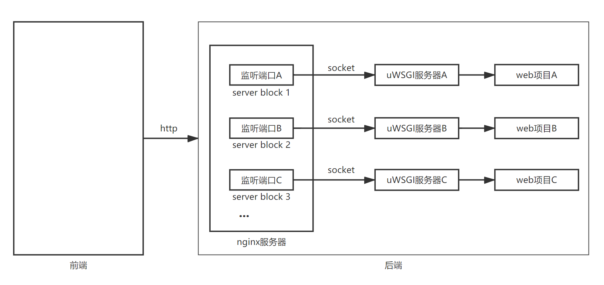

nginx+uwsgi+django
=======================

nginx
---------

- 反向代理：用于代理服务器，代替服务器接受请求并转发响应
- 正向代理：用于代理客户端，代替客户端发送请求并转发响应

uWSGI
----------

uWSGI是一个实现了WSGI协议、uwsgi协议、http协议的网关服务器。其会创建Unix套接字，通过uwsgi协议处理从web server传来的客户端的http请求，通过WSGI协议调用执行相应的django应用程序。

- WSGI：是一种通信协议，用于接收从web server传来的客户端的http请求，然后调用执行相应的django应用程序。总之，它用于规范web server与web application的通信
- uwsgi：是一种线路协议，用于规范uWSGI服务器与其它网络服务器的通信（是uWSGI服务器自有的协议）

    - 从前端到后端：the web client <--http--> the web server <--unix socket--> the uWSGI <----> Django application

nginx+uwsgi+django
------------------------

- nginx：处理静态文件；提高并发处理量；对多台uWSGI进行负载均衡；提高安全性
- uwsgi：web服务器和web程序之间的一种简单通用的接口，用于将HTTP协议转换为Python可以直接使用的WSGI协议。其包含的wsgi协议使得遵从此协议的web程序可以运行在任何web服务器上；uwsgi协议定义了传输信息的类型

从客户端发起请求到客户端收到响应的完整流程
    1. 浏览器请求
    2. nginx解包分析。如果是静态文件请求就根据nginx配置的静态文件目录返回请求的资源；如果是动态的请求，nginx通过配置文件将请求传递给uWSGI
    3. uWSGI 将接收到的包进行处理，并转发给wsgi
    4. wsgi根据请求调用django的某个view，view处理完后将返回值交给wsgi
    5. wsgi将返回值进行打包，转发给uWSGI，uWSGI接收后转发给nginx，nginx最终将返回值返回给浏览器

    - 注：不同的组件之间传递信息涉及到数据格式和协议的转换

部署步骤
''''''''''

1. 安装
    - nginx：apt-get install nginx
    - uwsgi：pip install uwsgi

2. 配置

    - uwsgi：在项目根目录下创建uwsgi/uwsgi.ini文件

    .. code-block:: ini

        # uwsgi.ini

        [uwsgi]

        # 项目文件的地址
        chdir      = /home/huaqiushi/Desktop/UniversalPlugin

        # 要使用的wsgi模块
        module     = UniversalPlugin.wsgi:application

        # 开启的进程（也称为worker）数量
        processes  = 4

        # 开启的线程数量
        threads    = 2

        # 开启主进程
        master     = True

        # 8000端口接收来自nginx的socket请求（此处若将socket改成http则可直接用uwsgi接收来自用户的http请求）
        socket     = 127.0.0.1:8000

        # 在指定的地址上开启状态服务
        stats      = 127.0.0.1:8080

        # 使进程在后台运行，并将日志输出到指定的文件
        daemonize  = /home/huaqiushi/Desktop/UniversalPlugin/uwsgi/uwsgi.log

        # 将主进程的pid记录到指定的文件中
        pidfile    = /home/huaqiushi/Desktop/UniversalPlugin/uwsgi/master.pid

        # 退出时清理环境——删除unix socket文件和pid文件
        vacuum     = True

    - nginx：在/etc/nginx/sites-available中添加配置文件，在/etc/nginx/sites-enabled中添加对配置文件的符号链接

    1. 反向代理（示例）

    .. code-block:: nginx

        server {
            listen       80;
            server_name  domain2.com www.domain2.com;
            access_log   logs/domain2.access.log  main;

            # serve static files
            location ~ ^/(images|javascript|js|css|flash|media|static)/  {
              root    /var/www/virtual/big.server.com/htdocs;
              expires 30d;
            }

            # pass requests for dynamic content to rails/turbogears/zope, et al
            location / {
              proxy_pass      http://127.0.0.1:8080;
            }
        }

    2. 负载均衡（示例）

    .. code-block:: nginx

        upstream big_server_com {
            server 127.0.0.3:8000 weight=5;
            server 127.0.0.3:8001 weight=5;
            server 192.168.0.1:8000;
            server 192.168.0.1:8001;
        }

        server {
            listen          80;
            server_name     big.server.com;
            access_log      logs/big.server.access.log main;

            location / {
              proxy_pass      http://big_server_com;
            }
        }

    3. 完整的配置（经过实践确认）

        /etc/nginx/下有四个关于nginx的配置文件：

            - nginx.conf：nginx的主配置文件（除过sever和upstream的配置；这两者定义在sites-enabled中）
            - conf.d：没有用到（作用未知）
            - sites-enabled：对要启用的server的符号链接
            - sites-available：一系列的server（以备在sites-enabled中启用）

    .. code-block:: nginx

        upstream django {
            server 127.0.0.1:8000;
        }

        server {
            listen       80;
            server_name  dolphin.com;
            charset      utf-8;

            client_max_body_size 75M;

            location /static {
                alias /home/huaqiushi/Desktop/UniversalPlugin/static;
            }

            location / {
                uwsgi_pass  django;  # django是在upstream中自定义的名称
                include     uwsgi_params;
            }
        }

3. 启动

    - uwsgi：uwsgi --ini /home/huaqiushi/Desktop/UniversalPlugin/uwsgi/uwsgi.ini
    - nginx：service nginx start

4. 收集静态文件

    - 在项目的settings文件中添加：STATIC_ROOT = '/home/huaqiushi/Desktop/UniversalPlugin/static/'

        - 注：STATIC_ROOT的作用是定义静态文件最终存放的文件夹；当静态文件收集完毕后，其将由nginx中定义的“location /static”去查找

    - 在终端运行：python manage.py collectstatic ——将所有应用的static文件夹中的静态文件拷贝到项目的static文件夹（即STATIC_ROOT）中
