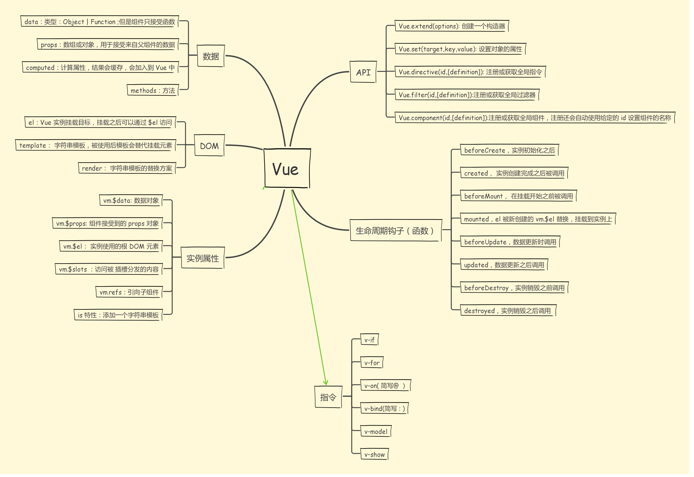

Vue
==========

.. contents:: 目录

Vue的核心是通过 **模板语法** **声明式地** 将数据渲染进DOM的系统（这个过程被称为 **声明式渲染**，这个渲染行为被成为 **响应式**）；即可以为DOM元素赋予变量。例如为一个div元素绑定一个Vue实例，则可以在这个div里使用这个实例的变量

- 注：Vue可以将数据渲染到DOM文本、DOM属性、DOM元素
- 注：Vue可以通过 **条件和循环** 将前端数据渲染进DOM——即将后端部分逻辑功能放在前端实现

HTML插值
-----------

在HTML中插入Vue实例中定义的变量。插值分为文本插值和指令插值（两者的值均可以为JS表达式）

- 文本插值

- 指令插值

    .. code-block:: html

          <form v-on:submit.prevent="onSubmit">...</form>
          <标签 指令:参数.修饰符="值">

          <!-- 指令是一种特殊的属性；指令的值可以是JS表达式 -->

    ========  ===========  ===========  =============================
      指令        参数         修饰符                 用途
    ========  ===========  ===========  =============================
    v-bind    HTML属性         无           HTML属性绑定
    v-on      DOM事件          有           事件监听
    v-for     无               无           列表渲染
    v-if      无               无           条件渲染
    v-model   无               有           表单输入绑定
    ========  ===========  ===========  =============================

绑定class, style
'''''''''''''''''''''

class, style本质上均是HTML属性，因此用v-bind指令绑定。其值可以是对象或者数组

- 对象

.. code-block:: html

    

    <!-- classObject: { active: true, 'text-danger': false } -->  <!-- 有连字符的属性名需要用单引号引起来 -->

    

    <!-- styleObject: { color: 'red', fontSize: '13px' } -->

- 数组

.. code-block:: html

    

    <!-- isActive为boolean类型 -->

    

事件监听的修饰符
'''''''''''''''''''

event.preventDefault(), event.stopPropagation()

.stop
.prevent
.capture
.self
.once
.passive

Vue实例
---------

计算属性
'''''''''''
计算属性的值是 **基于Vue实例定义的变量** 计算而来的变量

.. code-block:: html

    
{{ fullName }}

    

Vue实例的其他属性
''''''''''''''''''''''''

- components属性

组件
--------

组件是可复用的Vue实例（每用一次组件，就会有一个新的Vue实例被创建；组件相当于类，组件实例相当于类实例）

.. code-block:: js

    // 全局注册组件
    Vue.component('button-counter', {
      data: function () { return { count: 0 } },
      template: '<button v-on:click="count++">You clicked me {{ count }} times.</button>'
    })

    // 此处创建了一个根实例；只有在根实例中才能使用组件
    new Vue({ el: '#components-demo' })

.. code-block:: html

    <!-- 使用组件 -->
    
<button-counter></button-counter>

组件的props属性
'''''''''''''''''''
props是组件的一个属性。将模板中的一个属性值传递给props中的一个prop特性的时候，这个属性值就变成了那个组件实例的一个属性。

总结
--------

组件
''''''''''
Vue项目由组件构成，组件是HTML, JS, CSS的集合。每个组件都是自给自足的（除过组件间prop传值以及事件触发），即可以单独完成获取数据、处理数据、展示数据这一完整流程
- 注：所有组件均是Vue实例，不过只有一个根实例（即new Vue创建的实例）

生态系统
''''''''''
- vue-router: 前端路由
- axios: 发送ajax请求，获取后端数据
- vuex：状态管理
- vue-cli：快速搭建Vue项目
