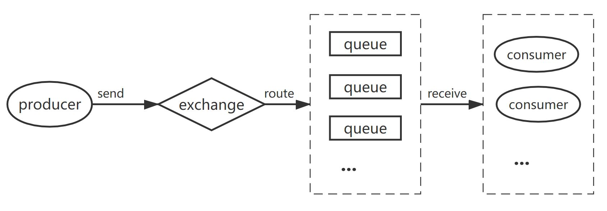

RabbitMQ
=============

将消息通过队列分发给消费者。

- producer：发送消息给exchange
- exchange：接收生产者的消息并以一定方式分发到队列中。有四种类型：direct, topic, headers, fanout

    - fanout：分发给每个消费者
    - direct：通过两个routing_key之间的匹配关系进行分发（生产者发布消息时的routing_key、队列绑定交换机时的routing_key）

        - routing_key：'orange'

    - topic：与direct相比，routing_key变为多个属性

        - routing_key：' * .orange.*', '*.*.rabbit', 'lazy.#'

    - headers：

- queue：存储消息（和交换机绑定以存储需要的信息）
- consumer：从某一个队列中获取消息并处理

分发方式
-----------
round-robin dispatching
''''''''''''''''''''''''''''
默认的分发方式。有多个消费者时，RabbitMQ将队列中的消息循环分发给每个消费者

fair dispatch
''''''''''''''''''
为了均衡地使用消费者——保证每个消费者只有一个正在处理的消息，channel.basic_qos(prefetch_count=1)

异常处理
------------
消费者异常——message acknowledge
''''''''''''''''''''''''''''''''''''
消费者处理消息时死亡会导致消息丢失——消费者完成任务后，发送确认信息给生产者，ch.basic_ack(delivery_tag = method.delivery_tag)

RabbitMQ异常——message durability
''''''''''''''''''''''''''''''''''''''
RabbitMQ退出或崩溃时会导致队列和消息丢失——声明队列时传入durable=True、发布消息时传入delivery_mode=2
