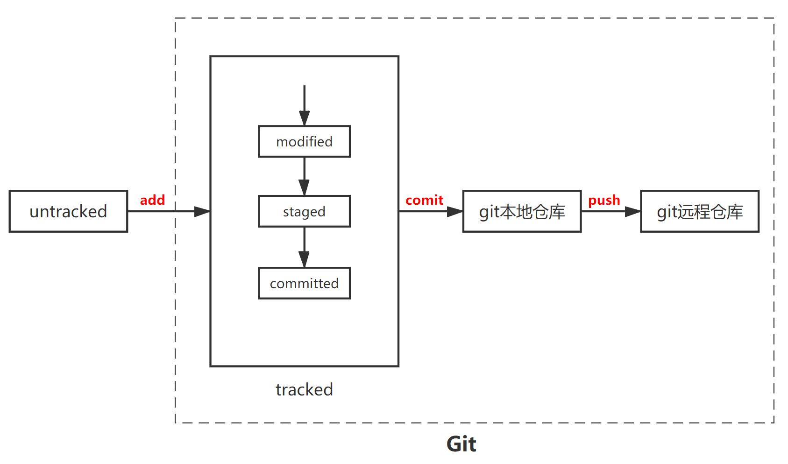

版本控制
===========

.. contents:: 目录

基本流程
-----------

a. 创建远程仓库
b. checkout 创建本地仓库（git为clone）
c. add 将代码加入本地仓库
d. commit 提交代码 **（svn提交至远程仓库；git提交至本地仓库（之后push提交至远程仓库））**

注：git与svn的区别在于：git的本地仓库是远程仓库的克隆，而svn的本地仓库可以只有远程仓库的部分代码

git中的文件的三种状态
----------------------
- 已修改（modified）：位于工作区。
- 已暂存（staged）：位于暂存区。对一个已修改文件的当前版本做了标记，使之包含在下次提交的快照中
- 已提交（committed）：位于本地仓库。

    - 注：工作区、暂存区和本地仓库都是逻辑意义上的划分，其在物理上通过对文件标记实现

